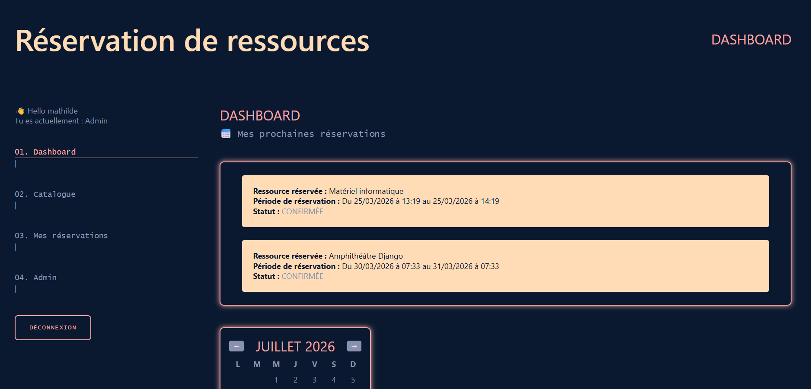
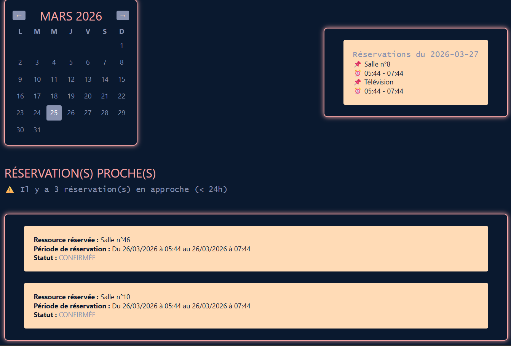
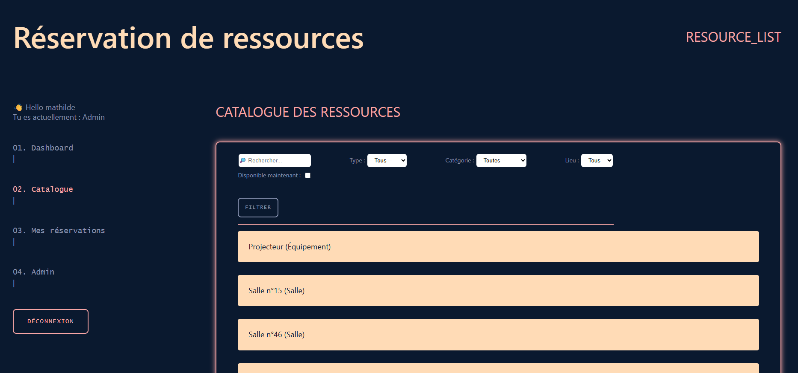
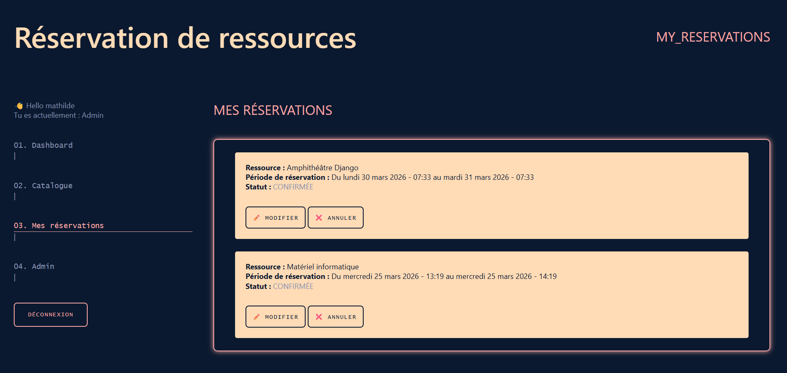
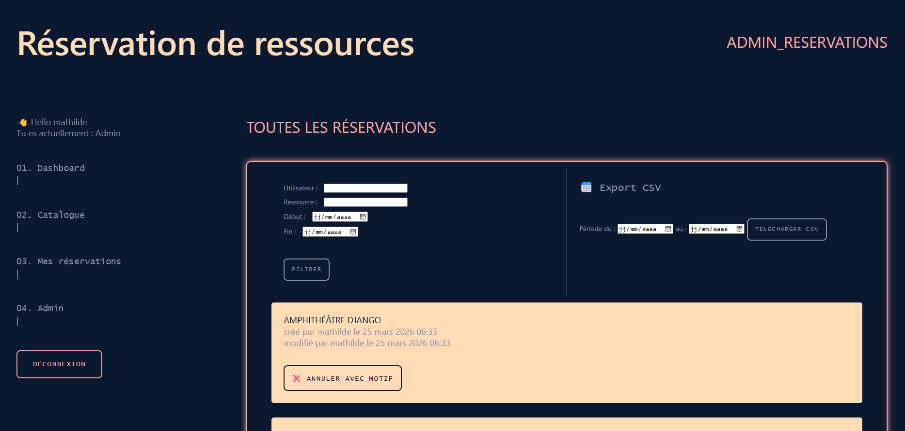

# 📅 Application de réservation de ressources

## 🧾 Description

Application web développée avec Django permettant de gérer la réservation de salles et d’équipements.

---

## ⚙️ Installation

### 1. Cloner le projet

```bash
git clone <repo_url>
cd reservation-app
```

### 2. Créer un environnement virtuel

```bash
python -m venv venv
source venv/bin/activate  # Mac/Linux
venv\Scripts\activate     # Windows
```

### 3. Installer les dépendances

```bash
pip install -r requirements.txt
```

---

## 🔐 Configuration

Créer un fichier `.env` à la racine :

```env
DB_NAME=reservation_db
DB_USER=sa
DB_PASSWORD=your_password
DB_HOST=localhost
DB_PORT=1433
```

---

## 🗄️ Migrations

```bash
python manage.py makemigrations
python manage.py loaddata demo_data.json
python manage.py migrate
```

---

## ▶️ Lancer le serveur

```bash
python manage.py runserver
```

---

## 👤 Comptes

Créer un superuser :

```bash
python manage.py createsuperuser
```

---

## 🖥 Schéma BDD

```bash
User
│
├── Reservation
│   ├── start_datetime
│   ├── end_datetime
│   ├── status
│   ├── created_at
│   ├── updated_at
│   └── FK → Resource
│
Resource
├── name
├── type
├── is_active
├── FK → Category
├── FK → Location
├── created_by
└── updated_by

Category
├── name
├── created_at
└── updated_at

Location
├── name
├── created_at
└── updated_at
```

---


## 💻 Aperçus

Dashboard :



Catalogue des ressources :


Réservations :

& admin view :



UI/UX Design inspiré de mon portfolio : 
mathildefauveau.com

